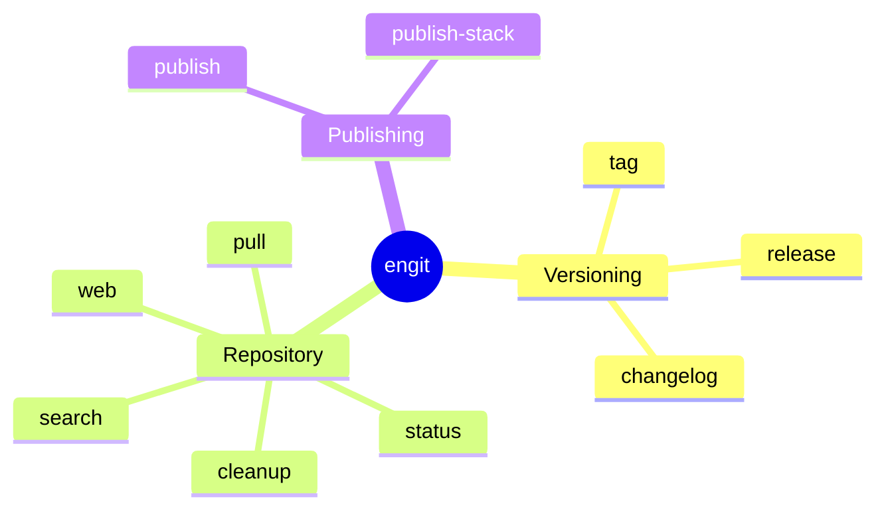
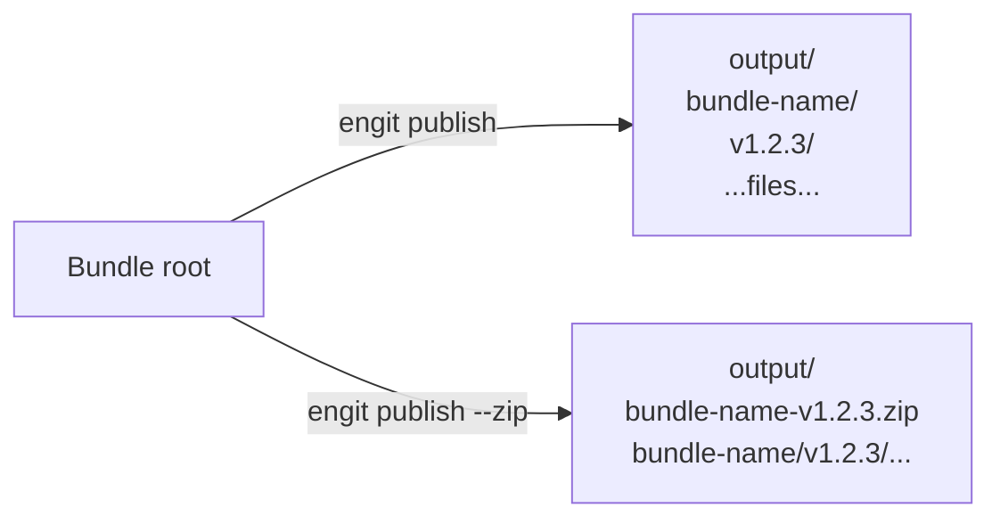

# engit CLI Reference

`engit` is the developer toolchain for envoy bundles — versioning, releasing, publishing, and repository management.

## Subcommands



## `engit tag`

Create an annotated semantic version git tag at HEAD.

```
engit tag (--major | --minor | --patch | --version VERSION) [OPTIONS]
```

| Flag | Description |
|---|---|
| `--major` | Increment major version, reset minor and patch to 0 |
| `--minor` | Increment minor version, reset patch to 0 |
| `--patch` | Increment patch version |
| `--version VERSION` | Explicit version (e.g. `v1.2.3`, `1.2.3-alpha`) |
| `--message`, `-m` | Supply tag annotation directly, skipping the editor |
| `--print`, `-p` | Print the computed next version without creating a tag |
| `--dry-run` | Print the planned tag without creating it |

**Examples:**

```powershell
engit tag --patch               # v1.0.1 (increments current latest)
engit tag --minor               # v1.1.0
engit tag --version 2.0.0       # explicit version
engit tag --version 1.2.3-alpha # pre-release (auto-sequences: v1.2.3-alpha.1)
engit tag --patch --dry-run     # preview without tagging
```

!!! note "Pre-release sequencing"
    When using `--version` with a pre-release suffix (e.g. `1.2.3-alpha`), omitting the sequence number auto-detects the next one. `v1.2.3-alpha.3` becomes `v1.2.3-alpha.4` if `.1`–`.3` already exist.

## `engit release`

Create a GitHub release from an existing tag.

```
engit release [OPTIONS]
```

| Flag | Description |
|---|---|
| `--tag TAG` | Tag to release. Defaults to the most recent semver tag |
| `--title TITLE` | Release title. Defaults to the tag string |
| `--draft` | Create as a draft release |
| `--remote REMOTE` | Remote to push to (default: `origin`) |
| `--generate-notes` | Append GitHub auto-generated "What's Changed" notes |
| `--print`, `-p` | Print resolved release notes without publishing |
| `--dry-run` | Print the planned release without creating it |

**Examples:**

```powershell
engit release                          # release latest tag
engit release --tag v1.2.3             # release specific tag
engit release --draft                  # create as draft first
engit release --generate-notes         # append GitHub PR summary
```

## `engit publish`

Create a clean versioned publish of a bundle — strips git and build artifacts and produces a folder or zip ready for deployment.

```
engit publish [PATH] [OPTIONS]
```

| Flag | Description |
|---|---|
| `PATH` | Bundle root directory. Defaults to the current directory |
| `--output`, `-o DIR` | Directory to write output into. Defaults to cwd |
| `--version VERSION` | Explicit version string. Defaults to latest semver git tag. Use `dev` for test builds |
| `--exclude PATTERN` | Additional glob pattern to exclude. May be specified multiple times |
| `--zip` | Create a zip archive instead of a versioned directory |
| `--dry-run` | List the files that would be included without writing output |

**Output layout:**



**Default exclusions:** `.git`, `.gitignore`, `.github`, `build`, `dist`, `.pytest_cache`, `__pycache__`, `*.pyc`, `*.pyo`, `*.pyd`

**Examples:**

```powershell
# Versioned folder in cwd (version auto-detected from git tag)
engit publish

# Zip into dist/, explicit version
engit publish --zip --output dist --version v1.2.0

# Test build without a git tag
engit publish --version dev --zip --output dist

# Dry run — preview file list
engit publish --dry-run

# Extra exclusions
engit publish --exclude scripts --exclude pyproject.toml --zip
```

## `engit status`

Show repository status — branch, ahead/behind remote, last semver tag, and most recent commit.

```
engit status [--remote REMOTE]
```

## `engit changelog`

Generate a formatted changelog from published GitHub releases, sorted by semantic version.

```
engit changelog [--tag TAG]
```

| Flag | Description |
|---|---|
| `--tag TAG` | Show only the release for this tag |

## `engit cleanup`

Prune stale remote-tracking refs, delete merged branches, and delete branches whose remote has been deleted.

```
engit cleanup [--remote REMOTE] [--noop]
```

| Flag | Description |
|---|---|
| `--remote REMOTE` | Remote to prune (default: `origin`) |
| `--noop` | Print what would be deleted without deleting anything |

## `engit web`

Open the repository on GitHub in the default browser.

```
engit web [--branch BRANCH] [--remote REMOTE]
```

## `engit pull`

Pull one or more envoy bundle checkouts by bundle ID.

```
engit pull BUNDLE [BUNDLE ...] [--remote REMOTE] [--rebase] [--dry-run]
```

| Argument/Flag | Description |
|---|---|
| `BUNDLE` | Bundle ID (e.g. `gt:globals`), or `*` to pull all bundles from `ENVOY_BNDL_ROOTS` |
| `--remote REMOTE` | Remote to pull from (default: `origin`) |
| `--rebase` | Pass `--rebase` to `git pull` |
| `--dry-run` | Print what would be pulled without running git |

**Examples:**

```powershell
engit pull gt:globals
engit pull gt:globals gt:pythoncore
engit pull *                    # pull all discovered bundles
engit pull * --dry-run
```

## `engit publish-stack`

Publish a stack YAML file to a named stack slot.  Writes a
timestamped version under `<stack-root>/<name>/` and updates the `latest`
pointer file so that `envoy --set-config stack=<name>` always
resolves to the newest published version.

```
engit publish-stack NAME SOURCE [OPTIONS]
```

| Argument/Flag | Description |
|---|---|
| `NAME` | Named stack slot (e.g. `studio`, `production`, `dev`) |
| `SOURCE` | Path to the strict YAML `.estack` file to publish |
| `--stack-root DIR`, `-r` | Stack root directory. Defaults to the first directory in `ENVOY_STACK_ROOTS` |
| `--dry-run` | Show what would be written without writing anything |

**Output structure:**

```
<stack-root>/
└── studio/
    ├── 2026-06-21T10-13-00.estack   ← newly published version
    └── latest                       ← updated to "2026-06-21T10-13-00.estack"
```

**Examples:**

```powershell
# Publish to the "studio" slot (stack root from ENVOY_STACK_ROOTS)
engit publish-stack studio R:/my/studio.estack

# Publish with explicit root
engit publish-stack studio R:/my/studio.estack --stack-root R:/studio/envoy/stacks

# Preview without writing
engit publish-stack studio R:/my/studio.estack --dry-run
```

After publishing, users can set `stack=studio` and envoy resolves it
to the latest version automatically:

```powershell
envoy --set-config stack=studio
envoy --list-configs   # shows all named Stacks and their latest version
```

## `engit search`

Search GitHub repositories matching a query, scoped to configured organisations.

```
engit search QUERY [--org ORG] [--limit N]
```

| Flag | Description |
|---|---|
| `--org ORG` | GitHub organisation to search. May be repeated. Overrides `ENGIT_ORGS` |
| `--limit N` | Maximum results per organisation (default: 20) |

The default organisations are read from the `ENGIT_ORGS` environment variable (semicolon-separated).
