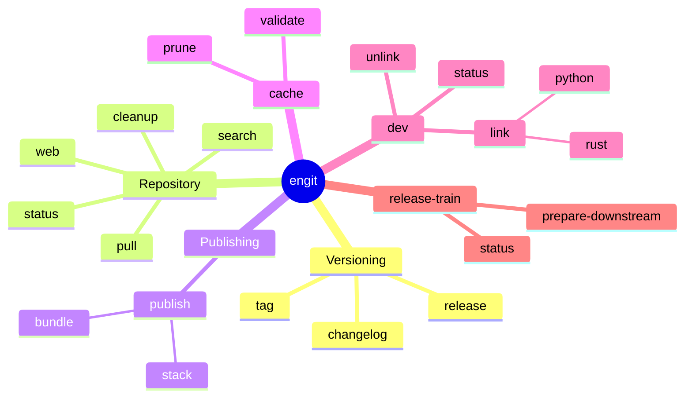

# engit CLI Reference

`engit` is the developer toolchain for envoy bundles — versioning, releasing, publishing, and repository management.

## Subcommands


```mermaid
mindmap
  root((engit))
    Versioning
      tag
      release
      changelog
    Repository
      status
      cleanup
      pull
      web
      search
    Publishing
      publish
        bundle
        stack
    cache
      validate
      prune
    dev
      link
        rust
        python
      unlink
      status
    release-train
      status
      prepare-downstream
```

## `engit tag`

Create an annotated semantic version git tag at HEAD.

```
engit tag (--major | --minor | --patch | --version VERSION) [OPTIONS]
```

| Flag | Description |
|---|---|
| `--major` | Increment major version, reset minor and patch to 0 |
| `--minor` | Increment minor version, reset patch to 0 |
| `--patch` | Increment patch version |
| `--version VERSION` | Explicit version (e.g. `v1.2.3`, `1.2.3-alpha`) |
| `--message`, `-m` | Supply tag annotation directly, skipping the editor |
| `--print`, `-p` | Print the computed next version without creating a tag |
| `--dry-run` | Print the planned tag without creating it |

**Examples:**

```powershell
engit tag --patch               # v1.0.1 (increments current latest)
engit tag --minor               # v1.1.0
engit tag --version 2.0.0       # explicit version
engit tag --version 1.2.3-alpha # pre-release (auto-sequences: v1.2.3-alpha.1)
engit tag --patch --dry-run     # preview without tagging
```

!!! note "Pre-release sequencing"
    When using `--version` with a pre-release suffix (e.g. `1.2.3-alpha`), omitting the sequence number auto-detects the next one. `v1.2.3-alpha.3` becomes `v1.2.3-alpha.4` if `.1`–`.3` already exist.

## `engit release`

Create a GitHub release from an existing tag.

```
engit release [OPTIONS]
```

| Flag | Description |
|---|---|
| `--tag TAG` | Tag to release. Defaults to the most recent semver tag |
| `--title TITLE` | Release title. Defaults to the tag string |
| `--draft` | Create as a draft release |
| `--remote REMOTE` | Remote to push to (default: `origin`) |
| `--generate-notes` | Append GitHub auto-generated "What's Changed" notes |
| `--print`, `-p` | Print resolved release notes without publishing |
| `--dry-run` | Print the planned release without creating it |

**Examples:**

```powershell
engit release                          # release latest tag
engit release --tag v1.2.3             # release specific tag
engit release --draft                  # create as draft first
engit release --generate-notes         # append GitHub PR summary
```

## `engit publish`

Publish runtime artifacts to their canonical studio locations.

### `engit publish bundle`

Create an immutable, versioned runtime bundle.

```text
engit publish bundle [PATH] [OPTIONS]
```

| Flag | Description |
|---|---|
| `PATH` | Bundle root or bundle ID. Defaults to the current directory |
| `--output`, `-o DIR` | Publish root. Defaults to `ENVOY_BUNDLE_PUBLISH_ROOT` |
| `--version VERSION` | Version. Defaults to the latest semver tag; use `dev` for development |
| `--include GLOB` | Add a root-relative runtime include; repeatable |
| `--exclude GLOB` | Add a root-relative exclusion; repeatable and takes precedence |
| `--zip` | Also create a zip containing the same runtime dataset |
| `--force` | Replace an existing `dev` publish; invalid for released versions |
| `--dry-run` | Validate and list files and destinations without writing |

Without `--output`, Engit uses `ENVOY_BUNDLE_PUBLISH_ROOT`.

The default runtime allowlist is:

- Directories: `.envoy`, `py`, `bin`, `prebuilt`, `resources`, `resource`, and `docs`
- Legal files: `LICENSE*`, `NOTICE*`, and `THIRD_PARTY_LICENSES*`

VCS metadata, build output, Cargo targets, tool caches, `__pycache__`, `*.pyc`,
and `*.pyo` are always excluded. Runtime extensions such as `.pyd`, `.dll`, and `.so`
remain eligible.

Released versions are immutable. Replacing an existing development publish requires
`--version dev --force`.

#### Publish manifest

Optional bundle policy lives at `.envoy/publish-manifest.yaml`:

```yaml
include:
  - custom-runtime/**

exclude:
  - docs/internal/**

artifacts:
  - source: ${ENVOY_STUDIO_ARTIFACTS}/ext/python/${BASE_VERSION}
    destination: .
    include:
      - custom/**
    exclude:
      - temporary/**
```

The manifest is strict: unknown keys, invalid globs, unresolved variables, missing
artifact sources, unsafe destinations, and destination collisions are errors. Defaults
apply to the bundle and each external source. Manifest rules customize their source,
CLI rules apply globally, and exclusions always win. `${VERSION}`,
`${BASE_VERSION}`, and environment variables are supported in artifact sources.

The retired `.envoy/bundle-artifacts.json` file is rejected with a migration error.

#### Examples

```powershell
# Publish to ENVOY_BUNDLE_PUBLISH_ROOT using the latest semver tag
engit publish bundle

# Publish a development build locally and also create a zip
engit publish bundle --output dist --version dev --zip

# Replace a prior development publish
engit publish bundle --output dist --version dev --force

# Preview an additional runtime path
engit publish bundle --include config/** --dry-run
```

### `engit publish stack`

Publish a validated `.estack` file to an immutable, timestamped named slot.
The stack name is derived from the source filename, and the source's
immediate parent directory must use the same name.

```text
<root>/<name>/<timestamp>/<name>.estack
```

```text
engit publish stack SOURCE [OPTIONS]
```

| Argument/Flag | Description |
|---|---|
| `SOURCE` | Strict YAML `.estack` file |
| `--output`, `-o DIR` | Stack publish root. Defaults to `ENVOY_STACK_PUBLISH_ROOT` |
| `--dry-run` | Validate and show planned writes without publishing |

```powershell
engit publish stack V:/repo/gtvfx-envoy/stacks/studio/studio.estack
engit publish stack V:/repo/gtvfx-envoy/stacks/studio/studio.estack --output R:/studio/envoy/stack
engit publish stack V:/repo/gtvfx-envoy/stacks/studio/studio.estack --dry-run
```

## `engit status`

Show repository status — branch, ahead/behind remote, last semver tag, and most recent commit.

```
engit status [--remote REMOTE]
```

## `engit changelog`

Generate a formatted changelog from published GitHub releases, sorted by semantic version.

```
engit changelog [--tag TAG]
```

| Flag | Description |
|---|---|
| `--tag TAG` | Show only the release for this tag |

## `engit cleanup`

Prune stale remote-tracking refs, delete merged branches, and delete branches whose remote has been deleted.

```
engit cleanup [--remote REMOTE] [--noop]
```

| Flag | Description |
|---|---|
| `--remote REMOTE` | Remote to prune (default: `origin`) |
| `--noop` | Print what would be deleted without deleting anything |

## `engit web`

Open the repository on GitHub in the default browser.

```
engit web [--branch BRANCH] [--remote REMOTE]
```

## `engit pull`

Pull one or more envoy bundle checkouts by bundle ID.

```
engit pull BUNDLE [BUNDLE ...] [--remote REMOTE] [--rebase] [--dry-run]
```

| Argument/Flag | Description |
|---|---|
| `BUNDLE` | Bundle ID (e.g. `gt:globals`), or `*` to pull all bundles from `ENVOY_BNDL_ROOTS` |
| `--remote REMOTE` | Remote to pull from (default: `origin`) |
| `--rebase` | Pass `--rebase` to `git pull` |
| `--dry-run` | Print what would be pulled without running git |

**Examples:**

```powershell
engit pull gt:globals
engit pull gt:globals gt:pythoncore
engit pull *                    # pull all discovered bundles
engit pull * --dry-run
```

## `engit search`

Search GitHub repositories matching a query, scoped to configured organisations.

```
engit search QUERY [--org ORG] [--limit N]
```

| Flag | Description |
|---|---|
| `--org ORG` | GitHub organisation to search. May be repeated. Overrides the default organisations from `ENVOY_GITHUB_ORGS` |
| `--limit N` | Maximum results per organisation (default: 20) |

The default organisations are read from the `ENGIT_ORGS` environment variable (semicolon-separated).

## `engit cache`

Inspect or clean up the local bundle cache that envoy populates automatically
during stack resolution.

### `engit cache validate`

Recompute each cached bundle's content hash and check for a metadata
sidecar, a missing storage directory, or content-hash directories with no
referencing cache entry (orphans left behind by interrupted writes).

```
engit cache validate [--cache-dir DIR]
```

| Flag | Description |
|---|---|
| `--cache-dir DIR` | Cache directory to validate. Defaults to the resolved default bundle cache (`ENVOY_BUNDLE_CACHE`, user config, or platform default) |

Exits non-zero if any problems are found.

### `engit cache prune`

Remove cached entries matching a selector, or -- with no selector --
immediately apply envoy's own age/size retention policy instead of waiting
for it to trigger on the next cache write.

```
engit cache prune [--cache-dir DIR] [--id BUNDLE_ID]... [--pattern GLOB] [--older-than DAYS] [--remove-orphans] [--dry-run]
```

| Flag | Description |
|---|---|
| `--cache-dir DIR` | Cache directory to prune. Defaults to the resolved default bundle cache |
| `--id BUNDLE_ID` | Restrict to entries with this exact bundle ID. May be repeated |
| `--pattern GLOB` | Restrict to entries whose bundle ID matches this glob pattern |
| `--older-than DAYS` | Restrict to entries created more than this many days ago |
| `--remove-orphans` | Also remove content-hash storage directories no longer referenced by the cache index |
| `--dry-run` | Print what would be removed without deleting anything. Not supported with no selector (the default retention policy has no preview mode) |

Selectors combine with AND semantics: `--id gt:globals --older-than 30`
prunes only cached entries for `gt:globals` older than 30 days, not every
entry matching either condition.

**Examples:**

```powershell
engit cache validate
engit cache prune --id gt:globals --dry-run
engit cache prune --pattern "gt:*" --older-than 60
engit cache prune --remove-orphans
engit cache prune                    # apply default retention policy now
```

## `engit dev`

Local cross-repo development helpers. Point this workspace's `envoy-core`
Cargo dependency, or a freshly built Envoy Python wheel, at an in-progress
local Envoy checkout instead of a published release -- reversibly, and
without a by-hand `Cargo.toml` edit. All state lives under the
already-gitignored `rust/target/engit-dev/`, so a link can never be
accidentally committed (`lint.yml` also fails fast if one is).

### `engit dev link rust`

Swap the `envoy-core` Cargo dependency to a local Envoy checkout, saving the
original pin so it can be restored exactly.

```
engit dev link rust [ENVOY]
```

| Argument | Description |
|---|---|
| `ENVOY` | Local Envoy checkout path or bundle ID (e.g. `gt:envoy`). Defaults to `gt:envoy`, resolved via `ENVOY_BNDL_ROOTS` |

Runs `cargo check --workspace` after swapping to confirm it resolves.
Re-running `engit dev link rust` with a different checkout re-points the
dependency without losing the originally saved pin.

### `engit dev link python`

Build a local Envoy Python wheel via `maturin` and install it into an
isolated, self-contained dev bundle (a generated `.envoy/python_env.json`
pointing `PYTHONPATH` at the installed wheel). No shared or global
site-packages are ever touched.

```
engit dev link python [ENVOY] [--release]
```

| Argument/Flag | Description |
|---|---|
| `ENVOY` | Local Envoy checkout path or bundle ID. Defaults to `gt:envoy` |
| `--release` | Build Envoy's Python wheel in release mode |

The interpreter is resolved via `envoy --which python`, matching whatever
Stack is currently active -- add the printed bundle directory's parent to
`ENVOY_BNDL_ROOTS` (or reference it directly) to make it available.

### `engit dev unlink`

Reverse a prior `engit dev link`.

```
engit dev unlink rust
engit dev unlink python
```

`unlink rust` restores the exact previously pinned `envoy-core` dependency
and reruns `cargo check --workspace`. `unlink python` removes the generated
dev bundle. Both are safe no-ops when nothing is currently linked.

### `engit dev status`

Show whether Rust and/or Python are currently dev-linked, and to what path.

```
engit dev status
```

**Examples:**

```powershell
engit dev link rust ..\envoy
engit dev status
engit dev unlink rust

engit dev link python ..\envoy --release
engit dev unlink python
```

## `engit release-train`

Cross-repo release-train orchestration across Envoy and its downstream
repositories (`envoy_utils`, `despatch`). See the
[releasing guide](https://gtvfx-envoy.github.io/envoy/maintainers/releasing/)
for the full release-train process this complements.

### `engit release-train status`

Print each repository's latest published release and any open, tracked
release-impact issue -- a single-pane view of the release-train checklist.

```
engit release-train status [--owner ORG] [--repo REPO]...
```

| Flag | Description |
|---|---|
| `--owner ORG` | GitHub organisation owning the release-train repositories (default: `gtvfx-envoy`) |
| `--repo REPO` | Repository to report on (`envoy`, `envoy_utils`, or `despatch`). May be repeated. Defaults to all three |

### `engit release-train prepare-downstream`

Compute the next version for a downstream repository and dispatch its
existing, unmodified `prepare-release.yml` workflow with that version and
the given Envoy pin. This never bypasses or auto-merges that workflow's own
validation and draft pull request -- it only ever triggers it.

```
engit release-train prepare-downstream --repo REPO --envoy-version VERSION [OPTIONS]
```

| Flag | Description |
|---|---|
| `--repo REPO` | Downstream repository to prepare (`envoy_utils` or `despatch`) |
| `--envoy-version VERSION` | Published, unprefixed Envoy semantic version to pin (e.g. `0.6.0`) |
| `--major` / `--minor` / `--patch` | Bump component of the latest release. Defaults to `--patch` when no bump or `--version` is given |
| `--version VERSION` | Explicit next downstream version, instead of bumping the latest release |
| `--owner ORG` | GitHub organisation (default: `gtvfx-envoy`) |
| `--dry-run` | Print the `gh` invocation without dispatching anything |

**Examples:**

```powershell
engit release-train status
engit release-train prepare-downstream --repo despatch --envoy-version 0.6.0 --dry-run
engit release-train prepare-downstream --repo envoy_utils --envoy-version 0.6.0
```
